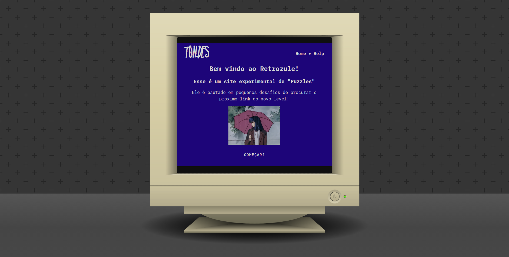

# Retrozule

## 🐦‍⬛ Descrição

> "_Um webjogo de puzzles envolvendo fáceis desafios de manipulação de url e html em uma temática retro_"



## ☁️ Rodando a aplicação

```bash
# Instalando e usando NODE 20:
nvm install 20; nvm use 20;

# Instalando dependências do projeto
npm install;

# Rodando o Retrozule
npm run dev;
```

## 🚀 Infos

-   **Tecnologias**: `Vue3`, `Nuxt3`, `Vuetify3`, `Javascript`, `CSS`
-   **Data**: 13/01/2023

---


