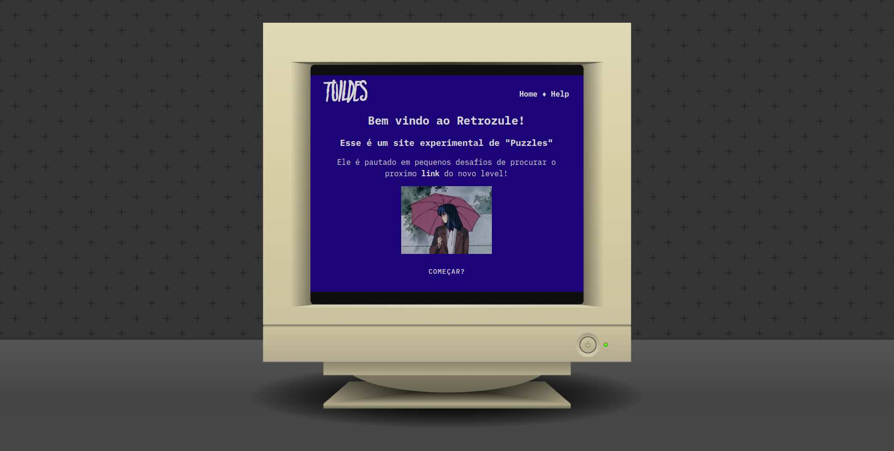

<p align="center">
  <h3 align="center">Retrozule</h3>
  <p align="center">Um webjogo de puzzles envolvendo fáceis desafios de manipulação de url e html em uma temática retro</p>
  <p align="center">
    
    
  </p>
</p>



## Objetivo
> Este foi um projeto utilizado para testar e aprender as tecnologias do Vue3 para uma migração interna de tecnologia feita na @ecomp no início de 2024
> Realizado totalmente em Vue3 e Nuxt3 e simula um jogo simples de manipulação de url e imagens, inspirado em Notpron, mas muito mais simples.

## ☁️ Rodando a aplicação

```bash
# Instalando e usando NODE 20:
nvm install 20; nvm use 20;

# Instalando dependências do projeto
npm install;

# Rodando o Retrozule
npm run dev;
```

## 🚀 Infos

-   **Tecnologias**: `Vue3`, `Nuxt3`, `Vuetify3`, `Javascript`, `CSS`
-   **Data**: 13/01/2024
